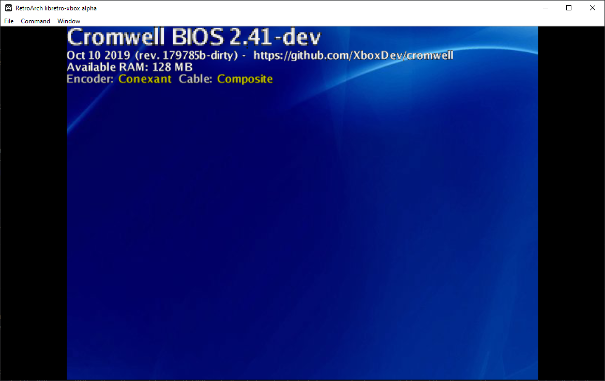

DirectXbox is a work-in-progress XBox OG emulator, written from the ground up for Libretro.

Currently requires the following BIOS images to be placed in the System directory:
* mcpx_1.0.bin
* cromwell_1024.bin

Supported platforms:
We currently are supporting only two platforms. We might be expanding our scope of supported platforms in the near future.
* Windows
* Linux

Requirements/dependencies:
* Libvirt86

Status:
+ PCI/ISA/SMBUS devices are partially implemented
+ Enough of the GPU is implemented for direct framebuffer access to work 
- Microsoft BIOS doesn't boot yet because ATA & OCHI are missing
- No hardware acceleration support yet (software rendering for now)

Compatibility:
Not much for now. Cromwell BIOS can boot, homebrew that theoretically only relies on basic framebuffer mode could theoretically work already.

Cromwell BIOS can only boot images, but not games.

Microsoft BIOS doesn't work yet (too much hardware that isn't implemented yet like ATA & OCHI)

Looking for contributors:
We are looking for contributors who would be interested in helping us carry this over the finish line. Some of the goals we are pursuing:
* Ability to boot Microsoft BIOS
* Commercial game compatibility
* Audio implemented
* OpenGL/Vulkan renderers

If there's some particular thing of interest that is not addressed by the above that you'd still like to explore, don't hesitate to contact us. We can be contacted at libretro@gmail.com
